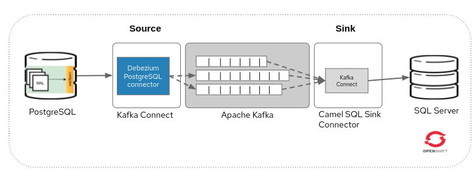

= Debezium and Red Hat Streams demo

This demo for Red Hat Streams (Kafka) will show how to replicate data and
data changes from a Postgres database with Debezium into a SQLServer db
using a Camel SQL Kafka Connector.

== Prerequisites

To run this demo you need to have an OpenShift cluster up and running and
a user with sufficient rights on that cluster.

=== Setup Project `appdev-kafka`
Setup a namespace for this example, e.g. this demo uses "appdev-kafka":

[source,console]
----
oc new-project appdev-kafka --display-name="Debezium AMQ Streams"
----
=== Setup Red Hat Container Registry Secret

For downloading the AMQ Streams Kafka container image in the next step,
a Registry Service Account must be created on the Red Hat Customer Portal
in the https://access.redhat.com/terms-based-registry/[Registry Service Accounts]
section.

== Installation and Configuration

The demo consist of all these components:

* PostgreSQL: the source database.

* Debezium PostgreSQL Connector: changes from one database table are written to a Kafka topic whose name corresponds to the table name.

*  AMQ stream cluster: a real time event streaming platform.

*  Kafka Connect with Camel SQL connector: reads the changed data capture messages from Kafka topics and, according to the message type, it applies an action to the SQL server database.

* SQL Server: target database

=== Install AMQ Streams (Strimzi Operator)

[NOTE]
====
In order to add Strimzi Operator the user needs to have right to add
CustomResourceDefinition objects.
====

[source,console]
----
oc apply -f 01-kafka-event-broker.yaml -n appdev-kafka
----

For further installation options, like using the OpenShift OperatorHub,
look at https://access.redhat.com/documentation/en-us/red_hat_amq/2020.q4/html/deploying_and_upgrading_amq_streams_on_openshift/deploy-intro_str#con-streams-installation-methods_str[AMQ Streams installation methods].

=== Setup demo databases
This demo uses the Debezium PostgreSQL Example database, and an empty SQL Server database as the destination.

==== PostgreSQL
The image used is from debezium repo, in particular a postgresql example with all debezium plugins for postgresql already installed: quay.io/debezium/example-postgres:1.9
The username and password are set as a parameter.  
[source,console]
----
oc adm policy add-scc-to-user anyuid system:serviceaccount:appdev-kafka:default
oc apply -f 02-postgres-service.yml -n appdev-kafka
----

==== SQL Server
Port is 1433 and username and passwords can be customized as a container parameter. 
Find the deployment of the SQL Server container here: https://raw.githubusercontent.com/johwes/sqlworkshops-sqlonopenshift/master/sqlonopenshift/01_deploy/sqldeployment.yaml

[source,console]
----
oc apply -f 03-msqldeployment.yml -n appdev-kafka
----
Database client, two options:   

* Through port-forwarding option to access from your local: oc port-forward “msql_pod_name” 1433:1433 &

* Get into the pod and /opt/mssql-tools/bin/sqlcmd -U sa -P XXXXXXX SELECT * FROM  INFORMATION_SCHEMA.TABLES; GO

Now it is time to create a database with the name dbo.order1, and also setup an orders table in that schema (use the sa user to create the new database and table and grant permissions):

`Order` table creation in SQL server:
[source,console,sql,title='create-table-order1.sql']
----
include::create-table-order1.sql[lines=1..-1]
----

=== Start Debezium Postgres Source Connector

Finally, it's time to start the Debezium Postgres Source Connector.

The YAML config points to the previously created PostgreSQL instance.

And apply that config:

[source,console]
----
oc apply -f 04-debezium-postgresql-connect.yml -n appdev-kafka
oc apply -f 05-debezium-postgresql-connector.yml -n appdev-kafka
----

=== Create a Custom AMQ Streams Kafka Connect Image

Build and push a custom container image for AMQ Streams Kafka Connect:

* Install `camel-sql-kafka-connector` package and Debezium connectors

* Add SQL Server driver into the `camel-sql-kafka-connector` directory

* Add `camel-debezium-common` and `debezium-core` jars into the `camel-sql-kafka-connector` directory

To sum up these are the files included in the tar.gz file (connector):

* Camel-sql-kafka-connector-0.11.5-package : camel sql kafka connector.

* Camel-debezium-common-3.9.0.jar : debezium tools for camel

* Mssql-jdbc-10.2.0.jre11.jar : driver SQL Server 

* debezium-core-1.9.2.Final.jar : debezium transformations and other features.

Tar.gz the directory camel-sql-kafka-connector-0.11.5.tar.gz

=== Check Messages in Managed Kafka

Now check if messages arrived in the Change Data Capture (CDC) Kafka topics
that were created by Kafka Connect, you can use Kafdrop or kafka-console-consumer.sh through the Kafka Connect pod:

[source,console]
----
./kafka-console-consumer.sh --bootstrap-server event-broker-dr-kafka-bootstrap.appdev-kafka.svc:9092 --topic inventory.inventory.orders --from-beginning
----

=== Start Apache Camel SQL Kafka Sink Connector

Now it's time to connect to that SQL server instance which was created
earlier and setup a `order1` table in that schema :

For the configuration of the Apache Camel SQL Kafka Sink Connector
`camel.component.sql.dataSource.user` and
`camel.component.sql.dataSource.password` are also referenced from the
properties files in the secrets previously created in the
<<Create Database Secrets for Connectors>> section.

Data shoudld be read from the Kafka topic of the `order1` table,
which is `inventory.inventory.products`.

The connector will apply Debezium's `ExtractNewRecordState`
Single-Message-Transform (SMT) and use the provided SQL Server
query to write messages into that `dbo.order1`
table.

[source,yaml,title='07-camel-connector-sink.yaml']
----
include::07-camel-connector-sink.yaml[lines=10..]
----

Applying that config to start the Camel SQL Kafka Sink Connector:

[source,console]
----
oc apply -f 06-camelsqlkafkaconnect.yml -n appdev-kafka
oc apply -f 07-camel-sql-connector-sink.yaml -n appdev-kafka
----

=== Validating Data Arrived in SQL Server

Now connect to the SQL instance and check if data successfully
arrived in the replicated table:

[source,sql]
----
SELECT * FROM order1;

# +-----+--------------------+---------------------------------------+--------+
# | id  | name               | description                           | weight |
# +-----+--------------------+---------------------------------------+--------+
# | 101 | scooter            | Small 2-wheel scooter                 |   3.14 |
# | 102 | car battery        | 12V car battery                       |    8.1 |
# | 103 | 12-pack drill bits | 12-pack of drill bits                 |    0.8 |
# | 104 | hammer             | 12oz carpenter's hammer               |   0.75 |
# | 105 | hammer             | 14oz carpenter's hammer               |  0.875 |
# | 106 | hammer             | 16oz carpenter's hammer               |      1 |
# | 107 | rocks              | box of assorted rocks                 |    5.3 |
# | 108 | jacket             | water resistent black wind breaker    |    0.1 |
# | 109 | spare tire         | 24 inch spare tire                    |   22.2 |
# +-----+--------------------+---------------------------------------+--------+
# 9 rows in set (0.01 sec)
----
