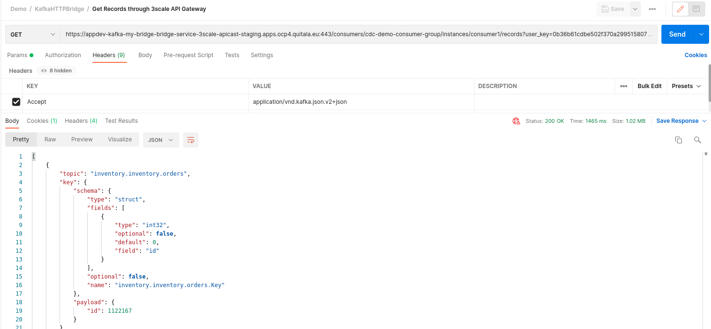

= Debezium and Red Hat Streams demo

This demo for Red Hat Streams (Kafka) will show how to replicate data and
data changes from a Postgres database with Debezium into a SQLServer db
using a Camel SQL Kafka Connector.

image::images/debezium-postgresql-sqlserver.png[]

At the end of this Readme you will find a second part (optional) of this demo, where, in addition, we expose CDC events through a **secure** REST API to both external or internal client applications. This is the diagram including the second part:

== Prerequisites

To run this demo you need to have an OpenShift cluster up and running and
a user with sufficient rights on that cluster.

=== Setup Project `appdev-kafka`
Setup a namespace for this example, e.g. this demo uses "appdev-kafka":

[source,console]
----
oc new-project appdev-kafka --display-name="Debezium AMQ Streams"
----
=== Setup Red Hat Container Registry Secret

For downloading the AMQ Streams Kafka container image in the next step,
a Registry Service Account must be created on the Red Hat Customer Portal
in the https://access.redhat.com/terms-based-registry/[Registry Service Accounts]
section.

== Installation and Configuration

The demo consist of all these components:

* PostgreSQL: the source database.

* Debezium PostgreSQL Connector: changes from one database table are written to a Kafka topic whose name corresponds to the table name.

*  AMQ stream cluster: a real time event streaming platform.

*  Kafka Connect with Camel SQL connector: reads the changed data capture messages from Kafka topics and, according to the message type, it applies an action to the SQL server database.

* SQL Server: target database

* In addition, for monitoring Debezium together with all the components we deploy: 
**  Prometheus: provides an open source set of components for systems monitoring and alert notification.
**  Grafana: provides visualizations of Prometheus metrics.

=== Install Red Hat AMQ Streams (Strimzi Operator)

[NOTE]
====
In order to add Strimzi Operator the user needs to have right to add
CustomResourceDefinition objects.
====

[source,console]
----
oc apply -f 01-kafka-event-broker.yml -n appdev-kafka
----

For further installation options, like using the OpenShift OperatorHub,
look at https://access.redhat.com/documentation/en-us/red_hat_amq/2020.q4/html/deploying_and_upgrading_amq_streams_on_openshift/deploy-intro_str#con-streams-installation-methods_str[AMQ Streams installation methods].

Next command addresses an issue with the persisten volume creation (might be unnecessary).

[source,console]
----
oc adm policy add-scc-to-user anyuid system:serviceaccount:appdev-kafka:default
----

=== Setup demo databases
This demo uses the Debezium PostgreSQL Example database, and an empty SQL Server database as the destination.

==== PostgreSQL
The image used is from debezium repo, in particular a postgresql example with all debezium plugins for postgresql already installed: quay.io/debezium/example-postgres:1.9
The username and password are set as a parameter.  
[source,console]
----
oc apply -f 02-postgres-service.yml -n appdev-kafka
----

==== SQL Server
Port is 1433 and username and passwords can be customized as a container parameter. 
Find the deployment of the SQL Server container here: https://raw.githubusercontent.com/johwes/sqlworkshops-sqlonopenshift/master/sqlonopenshift/01_deploy/sqldeployment.yaml

[source,console]
----
oc apply -f 03-msqldeployment.yml -n appdev-kafka
----
Database client, two options:   

* Through port-forwarding option to access from your local: `+oc port-forward <msql_pod_name> 1433:1433+`

* Get into the pod and `/opt/mssql-tools/bin/sqlcmd -U sa -P change-mssql-pwd`

Then issue the follwing commands:

[source,console]
----
1> SELECT * FROM  INFORMATION_SCHEMA.TABLES
2> GO
----

Now it is time to create a database with the name dbo.order1, and also setup an orders table in that schema (use the sa user to create the new database and table and grant permissions):

`Order` table creation in SQL server:

[source,properties,title='create-table-order1.sql']
----
include::create-table-order1.sql[]
----

=== Start Debezium Postgres Source Connector

Finally, it's time to start the Debezium Postgres Source Connector.

The YAML config points to the previously created PostgreSQL instance.

And apply that config:

[source,console]
----
oc apply -f 04-debezium-postgresql-connect.yml -n appdev-kafka
oc apply -f 05-debezium-postgresql-connector.yml -n appdev-kafka
----

=== Create a Custom AMQ Streams Kafka Connect Image 

*Note* You don't have to do anything in this section if you have access this file: http://httpd-example-appdev-kafka.apps.ocp4.quitala.eu/camel-sql-kafka-connector-0.11.5.tar.gz ,since I built the connector tar.gz for you.

Build and push a custom container image for AMQ Streams Kafka Connect:

* Install `camel-sql-kafka-connector` package and Debezium connectors

* Add SQL Server driver into the `camel-sql-kafka-connector` directory

* Add `camel-debezium-common` and `debezium-core` jars into the `camel-sql-kafka-connector` directory

To sum up these are the files included in the tar.gz file (connector):

* Camel-sql-kafka-connector-0.11.5-package : camel sql kafka connector.

* Camel-debezium-common-3.9.0.jar : debezium tools for camel

* Mssql-jdbc-10.2.0.jre11.jar : driver SQL Server 

* debezium-core-1.9.2.Final.jar : debezium transformations and other features.

Tar.gz the directory camel-sql-kafka-connector-0.11.5.tar.gz

=== Check Messages in Managed Kafka

Now check if messages arrived in the Change Data Capture (CDC) Kafka topics
that were created by Kafka Connect, you can use Kafdrop or kafka-console-consumer.sh through the Kafka Connect pod:

[source,console]
----
./kafka-console-consumer.sh --bootstrap-server event-broker-dr-kafka-bootstrap.appdev-kafka.svc:9092 --topic inventory.inventory.orders --from-beginning
----

=== Start Apache Camel SQL Kafka Sink Connector

Now it's time to connect to that SQL server instance which was created
earlier and setup a `order1` table in that schema :

For the configuration of the Apache Camel SQL Kafka Sink Connector
`camel.component.sql.dataSource.user` and
`camel.component.sql.dataSource.password` are also referenced from the
properties files in the secrets previously created in the
<<Create Database Secrets for Connectors>> section.

Data shoudld be read from the Kafka topic of the `order1` table,
which is `inventory.inventory.products`.

The connector will apply Debezium's `ExtractNewRecordState`
Single-Message-Transform (SMT) and use the provided SQL Server
query to write messages into that `dbo.order1`
table.

Applying that config to start the Camel SQL Kafka Sink Connector:

[source,console]
----
oc apply -f 06-camelsqlkafkaconnect.yml -n appdev-kafka
oc apply -f 07-camel-sql-connector-sink.yaml -n appdev-kafka
----

=== Validating Data Arrived in SQL Server

Now connect to the SQL instance and check if data successfully
arrived in the replicated table:

[source,sql]
----
SELECT * FROM order1;

# +-------+--------------------+-------------+------------+-------------------+
# | id    |    order_date      | purchaser   | quantity   |   product_id      |
# +-------+--------------------+-------------+------------+-------------------+
# | 10001 |    2016-01-31      |    1001     |     1      |       102         |
# | 10002 |    2016-01-31      |    1002     |     1      |       105         |
# | 10003 |    2016-01-31      |    1002     |     1      |       106         |
# | 10004 |    2016-01-31      |    1003     |     1      |       107         |
# +-------+--------------------+-------------+------------+-------------------+
# 4 rows in set (0.01 sec)
----

Now connect to the SQL instance and check if data successfully
arrived in the replicated table:

== Monitoring

*This demo will use Prometheus Operator and Grafana Operator to deploy them and monitor the AMQ Streams ecosystem easily.*

Note: The Kafka and Debezium metrics configurations are already created when you applied 01-kafka-event-broker.yml and 04-debezium-postgresql-connect.yml scripts.

=== Installing Prometheus and Grafana Operators (install both)
1. Navigate to the OperatorHub (Operators -> OperatorHub)
2. Type prometheus / grafana in the Filter by keyword
3. Select on the Prometheus / Grafana Operator
4. Review the Community Operator notice, and click Continue
5. Click Install
6. Review the default options, and click Subscribe

=== Grafana Configuration

1.Set up the prometheus HTTP URL: http://prometheus-operated.appdev-kafka.svc:9090 into the Prometheus data source.

2.Import Grafana dashboards:
**** 
. Go to "Create (Dashboard)" option -> import and click on the "upload json" button
.. **Debezium** select debezium-dashboard.json file included in this repo.
.. **Strimzi** find the dashboards json files in this repo: https://github.com/strimzi/strimzi-kafka-operator/tree/main/examples/metrics/grafana-dashboards 
****

3.Go to the Debezium dashboard and set these parameters as follows to run:
****
. Connector Type: **postgres**
. Connector Name: **inventory**
****

== SECOND PART: Adding HTTP REST API and Protection  (Optional)

This section exposes CDC events through a **secure** REST API to both external or internal client applications.
**Prerequisites**: 3scale deployed on the same Debezium OpenShift cluster.

=== Kafka HTTP Bridge 
HTTP Bridge and Route creation:
[source,console]
----
oc apply -f 08-kafkabridgehttp.yml -n appdev-kafka
----

=== Kafka HTTP Bridge / 3scale Integration

3scale enables security and protection to the REST API provided by Kafka HTTP bridge, now you can monitor API traffic and expose the API to external consumers in a secure way. 

When Kafka HTTP Bridge and 3scale are running in the same OpenShift cluster you can use the **3scale service discovery** feature, which it is possible to scan for discoverable API services that are running in the same OpenShift cluster and automatically import the associated API definitions into 3scale.

To discover the HTTP Bridge service with 3scale when it is deployed in a different namespace. There are two options depending on whether you are allowed to view a specific OpenShift user or the 3scale service account:

**** 
. Give permission to a specific 3scale/OpenShift user:  
https://access.redhat.com/documentation/en-us/red_hat_3scale_api_management/2.6/html/admin_portal_guide/service-discovery

. Give permission to the 3scale service account. In order to add view permissions to the service account amp you need to use the following command, noticing the syntax which references the scc is: “system:serviceaccount:namespace:serviceaccountname”. 
    The 3scale service account is called amp and the 3scale namespace in my environment is appdev-apimanager
[source,console]
----
    oc adm policy add-role-to-user view system:serviceaccount:appdev-apimanager:amp -n appdev-kafka
    oc rollout latest dc/system-app
----
****

=== 3scale configuration

==== Import the Kafka HTTP API
After giving permissions, 3scale is able to discover the Kafka HTTP API. Just signing in 3scale Administration console, create new product and choosing "Import from OpenShift". You will see the service successfully imported in 3scale. 

==== Create a 3scale Application Plan
For publishing an API in 3scale you must configure at least an Application Plan with their rate limits if this is a requirement.

==== Create an Application Client 
In order to obtain the credential to access the API, create a 3scale Application through Accounts --> choose an Account --> Click on "New Application" button.

After this, you have to save the credential generated for testing ( YOUR-3SCALE-CREDENTIALS )

==== Getting the 3SCALE-GATEWAY-HTTP-BRIDGE-URL
Go to the HTTP bridge service (i.e my-bridge-bridge-service)  --> Integration --> Configuration and get the URL from Staging APIcast or Production APIcast whatever you prefer.

=== Testing

Take a look at this article to understand how the Kafka HTTP bridge works: 
https://strimzi.io/blog/2019/07/19/http-bridge-intro/

NOTE: replace these parameters in the following curl calls: 
  . *3SCALE-GATEWAY-HTTP-BRIDGE-URL* by the 3scale URL specified in the 3scale Kafka HTTP bridge service configuration
  . *YOUR-3SCALE-CREDENTIALS* by your 3scale credentials obtained from the 3scale application.

==== 1. Consumer subscription

This calls creates a consumer called "consumer1" belonging to the "cdc-demo-consumer-group" group.

[source,console]
----
curl --location --request POST 'https://3SCALE-GATEWAY-HTTP-BRIDGE-URL/consumers/cdc-demo-consumer-group?user_key=YOUR-3SCALE-CREDENTIALS' \
--header 'Accept: application/vnd.kafka.v2+json' \
--header 'Content-Type: application/vnd.kafka.v2+json' \
--data-raw '{
    "name": "consumer1",
    "format": "json",
    "auto.offset.reset": "earliest",
    "enable.auto.commit": false,
    "fetch.min.bytes": 512,
    "consumer.request.timeout.ms": 30000,
    "isolation.level": "read_committed"
}'
----

==== 2. Topics subscription

[source,console]
----
curl --location --request POST 'https://3SCALE-GATEWAY-HTTP-BRIDGE-URL/consumers/cdc-demo-consumer-group/instances/consumer1/subscription?user_key=YOUR-3SCALE-CREDENTIALS' \
--header 'Accept: application/vnd.kafka.v2+json' \
--header 'Content-Type: application/vnd.kafka.v2+json' \
--data-raw '{
    "topics": [
       "inventory.orders",
       "inventory.inventory.products",
       "inventory.inventory.customers"
    ]
}'
----

==== 3. Get CDC records

NOTE: you need to call many times before obtaining a result otherwise you see something like "..topics:[]"
Read these links to understand why:
https://github.com/strimzi/strimzi-kafka-bridge/issues/520 
https://access.redhat.com/documentation/en-us/red_hat_amq_streams/2.1/html/using_the_amq_streams_kafka_bridge/assembly-kafka-bridge-quickstart-bridge

[source,console]
----
curl --location --request GET 'https://3SCALE-GATEWAY-HTTP-BRIDGE-URL/consumers/cdc-demo-consumer-group/instances/consumer1/records?user_key=YOUR-3SCALE-CREDENTIALS' \
--header 'Accept: application/vnd.kafka.json.v2+json'
----

Example using Postman:

